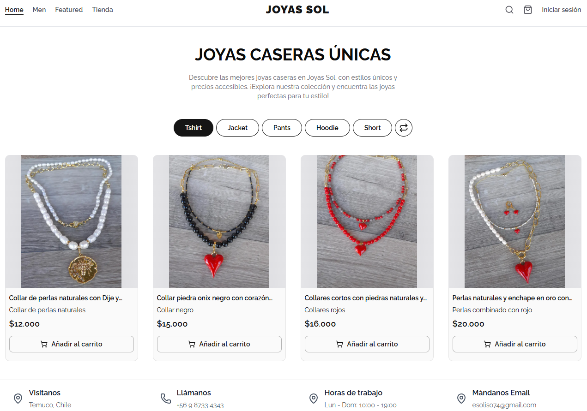

# Joyas Sol Ecommerce Application

> A modern, full-stack ecommerce platform built with Next.js 16, Sanity CMS, Clerk Auth, and Stripe

[](https://nextjs.org/)
[](https://react.dev/)
[](https://www.typescriptlang.org/)


[](LICENSE)

## 📑 Table of Contents

- [Preview](#-preview)
- [Features](#-features)
- [Prerequisites](#-prerequisites)
- [Getting Started](#-getting-started)
- [Environment Variables](#-environment-variables)
- [Project Structure](#-project-structure)
- [Deployment](#-deployment)
- [Contributing](#-contributing)
- [License](#-license)
- [Credits](#-credits)

## 🔗 Preview

- **Live Demo:** [https://joyassol.cl](https://joyassol.cl)
- **Sanity Studio:** [https://joyassol.cl/admin/studio](https://joyassol.cl/admin/studio)



## ✨ Features

- 🛒 **Shopping Cart** - Full-featured cart with Zustand state management
- 🔐 **Authentication** - Secure auth with Clerk (Google, Facebook, Email)
- 💳 **Payments** - Stripe integration for secure payments
- 📝 **CMS** - Content management with Sanity headless CMS
- 🔍 **Search** - Real-time product search with filtering
- 📱 **Responsive** - Mobile-first design approach
- 🎨 **Modern UI** - Beautiful interface with Tailwind CSS + shadcn/ui
- ⚡ **Performance** - Optimized with Next.js 16 App Router
- 📦 **TypeScript** - Full type safety throughout the application

## 📋 Prerequisites

Before you begin, ensure you have:

- **Node.js** 18 or higher
- **pnpm** package manager
- **Git** for version control
- Accounts on:
  - [Sanity.io](https://www.sanity.io)
  - [Clerk](https://clerk.dev)
  - [Stripe](https://stripe.com)

## 🚀 Getting Started

### 1. Clone the Repository

```bash
git clone https://github.com/kianush00/joyassol-ecommerce.git
cd joyassol-ecommerce
```

### 2. Install Dependencies

```bash
pnpm install
```

### 3. Set Up Sanity CMS

1. Create a Sanity account at [sanity.io](https://www.sanity.io)
2. Create a new project in the Sanity dashboard
3. Copy your Project ID

```bash
# Initialize Sanity in your project
pnpm create sanity@latest -- --project YOUR_PROJECT_ID --dataset production --template clean
```

### 4. Configure Environment Variables

Create a `.env` file in the root directory:

```bash
# Base URL
NEXT_PUBLIC_BASE_URL=http://localhost:3000

# Sanity
NEXT_PUBLIC_SANITY_PROJECT_ID=your_project_id
NEXT_PUBLIC_SANITY_DATASET=production
SANITY_API_TOKEN=your_api_token
SANITY_API_READ_TOKEN=your_read_token

# Clerk Authentication
NEXT_PUBLIC_CLERK_PUBLISHABLE_KEY=your_clerk_publishable_key
CLERK_SECRET_KEY=your_clerk_secret_key
NEXT_PUBLIC_CLERK_SIGN_IN_URL=/signin

# Stripe Payments
STRIPE_SECRET_KEY=your_stripe_secret_key
STRIPE_WEBHOOK_SECRET=your_stripe_webhook_secret
```

> ⚠️ **Important:** Never commit your `.env` file. It's already in `.gitignore`.

#### Where to Find These Keys

**Sanity:**

- Go to [sanity.io/manage](https://www.sanity.io/manage)
- Select your project → API → Add API Token

**Clerk:**

- Dashboard at [dashboard.clerk.com](https://dashboard.clerk.com)
- API Keys section

**Stripe:**

- Dashboard at [dashboard.stripe.com](https://dashboard.stripe.com)
- Developers → API Keys

### 5. Grant Admin Access

To access the Sanity Studio:

1. Go to [dashboard.clerk.com](https://dashboard.clerk.com)
2. Users → Select your user → Metadata
3. Edit "Public" metadata:

```json
{
  "role": "admin"
}
```

### 6. (Optional) Import Demo Data

```bash
pnpm dlx sanity@latest dataset import seed.tar.gz
```

### 7. Run Development Server

```bash
pnpm dev
```

Visit:

- **Frontend:** [http://localhost:3000](http://localhost:3000)
- **Sanity Studio:** [http://localhost:3000/admin/studio](http://localhost:3000/admin/studio)

### 8. Test Stripe Webhooks (Local Development)

In a separate terminal, forward Stripe events:

```bash
stripe listen --forward-to http://localhost:3000/api/webhook
```

> 💡 **Note:** This is only for local testing. In production, configure webhooks in Stripe Dashboard.

## 📁 Project Structure

```
joyassol-ecommerce/
├── actions/ # Server Actions
├── app/ # Next.js App Router
│ ├── (client)/ # Client-facing pages
│ └── admin/ # Admin dashboard
├── components/ # React components
│ ├── ui/ # shadcn/ui components
│ ├── Cart/ # Cart components
│ ├── Product/ # Product components
│ └── ...
├── hooks/ # Custom React hooks
├── lib/ # Utility functions
└── public/ # Static assets
├── sanity/ # Sanity CMS configuration
│ ├── schemas/ # Content schemas
│ └── lib/ # Sanity utilities
```

## 🚢 Deployment

### Deploy to Vercel (Recommended)

1. Push your code to GitHub
2. Import project in [Vercel](https://vercel.com)
3. Configure environment variables
4. Deploy!

### Configure Stripe Webhooks

In production, add your Vercel URL to Stripe:

https://your-domain.vercel.app/api/webhook

## Customizing

To tailor the template to your needs:

- Modify files in the /app and /components directories.
- Changes will reflect instantly due to Next.js’s hot reloading feature.
- After modifying any Sanity's schema types, or after adding a new GROQ query, run the following command to generate GROQ query typing:

```bash
pnpm typegen
```

## 🤝 Contributing

Contributions are welcome! Please:

1. Fork the repository
2. Create a feature branch
3. Commit your changes
4. Push to the branch
5. Open a Pull Request

## 📄 License

This project is licensed under the MIT License - see the [LICENSE](LICENSE) file for details.

## 💬 Support

- 📧 Email: [kianush.atighi@gmail.com](mailto:kianush.atighi@gmail.com)
- 🐛 Issues: [GitHub Issues](https://github.com/kianush00/joyassol-ecommerce/issues)

## 🙏 Credits

Inspired by the excellent work of **Noor Mohammad** ([@noorjsdivs](https://github.com/noorjsdivs)) and his [Tulos Ecommerce](https://github.com/noorjsdivs/tulos_updated) project.

## 📚 Learn More

- [Next.js Documentation](https://nextjs.org/docs)
- [Sanity Documentation](https://www.sanity.io/docs)
- [Clerk Documentation](https://clerk.dev/docs)
- [Stripe Documentation](https://stripe.com/docs)
- [Tailwind CSS](https://tailwindcss.com/docs)
- [shadcn/ui](https://ui.shadcn.com/)

---

<div align="center">

**Made with ❤️ by [kianush00](https://github.com/kianush00)**

⭐ Star this repo if you find it helpful!

</div>
